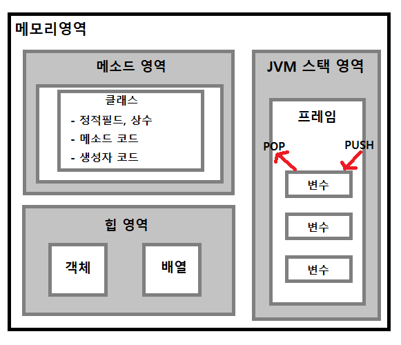

# 0. Java 
> 혼자 공부하는 자바 - 신용권
# 1. 자바 개발 도구 설치 및 설정

* Oracle JDK 설치
* JAVA_HOME 환경변수 등록
  * 제어판 -> 시스템 -> 고급시스템설정 -> 환경변수 -> 시스템 변수 -> 새로만들기
  * 변수 이름: JAVA_HOME
  * 변수 값: C:Program Files\java\jdk-19.0.1  ( 파일경로 )
* Path 환경 변수 수정
  * 환경변수 -> 시스템 변수 -> 편집 -> 새로만들기 
  * %JAVA_HOME%\bin 입력 -> 맨위로 이동 시키기
* 이클립스 설치
  * exe파일 -> 권리자 권한으로 실행 -> Eclipse IDE for Enterprsise Java and ... 클릭
  * 설치폴더 -> C:\Program Files -> Install -> Launch -> Launch
* 퍼스펙티브와 뷰
  * eclipse 실행 -> window -> perspective -> open perspectiv -> java
* 프로젝트 생성, Java SE 모듈
  * 프로젝트 생성 -> module-info.java 파일-> 중괄호안에 requires java.se; 입력 후 저장.
  * 프로젝트의 src폴더 -> new -> package -> name 입력 -> finish
  * 생성한 package 우클릭 -> new -> class -> name 입력 -> public static void main 체크 -> finish
<hr>

# 2. 변수와 타입
* 핵심 키워드
  * 2-1. 변수, 변수선언, 변수사용, 변수범위
  * 2-2. 정수타입, 실수타입, char타입, string타입, boolean 타입
  * 2-3. 자동타입변환, 강제타입변환, Integer.parseInt(), Double.parseDouble(), string.valueOf()
  * 2-4. System.out.println(), System.out.printf(), System.in.read(), Scanner
<hr>

## 2-1. 변수
* 변수는 값을 저장할 수 있는 메모리의 특정 번지에 붙이는 이름.
* 변수가 초기화 되면 메모리 번지 정보를 갖고, 해당 메모리 번지에 값이 저장됨.
* 정수타입의 변수에는 정수타입만, 실수타입의 변수에는 실수타입만 저장할 수 있음.
* 모든 변수는 중괄호 {} 블록 내에서 선언되고 사용됨.
* 메서드 블록 내에서 선언된 변수는 로컬 변수라고 부름.
* 로컬 변수는 메서드 블록 내부에서만 사용되고 메서드 실행이 끝나면 메모리에서 없어짐.
<hr>

## 2-2. 기본 타입

| 저장되는 값에 따른 분류 | 타입의 종류 | 
|---|:---:|
| 정수 타입 | byte, char, short, int, long |
| 실수 타입 | float, double |
| 논리 타입 | boolean |

### 2-2-1. 정수타입

| 타입 | 메모리 사용 크기 | 
|---|:---:|
| byte | 1byte |
| short | 2byte |
| char | 2byte |
| int | 4byte |
| long | 8byte |
  * 정수 리터럴
    * 소스 코드에서 프로그래머에 의해 직접 입력된 값을 리터럴 이라고 부름.
    * 2진수: 0b, 0B로 시작.
    * 8진수: 0으로 시작.
    * 16진수: 0x로 시작.
  * long타입 변수에 정수 리터럴을 저장할때 범위가 int 타입의 범위를 넘는다면 뒤에 L을 붙여야 함.
  * char 타입
    * char 타입은 음수를 가질 수 없음.
    * 하나의 문자를 작은따옴표(')로 감싼 것을 문자 리터럴이라 함.
    * 문자 리터럴은 유니코드로 변환되어 저장됨.
  * string 타입
    * 큰따옴표(")로 감싼 문자들을 문자열이라 함.
    * 문자열을 변수에 저장할땐 string 타입을 사용해야함.
* 이스케이프 문자
  * \(역슬래시)를 사용함.
  * \" : `string str = " hello \"java" ";         // 출력: hello "java" `
  * \' : ' 출력
  * \\ : \ 출력
  * \t : 탭만큼 띄우기
  * \n : 개행
<hr>

### 2-2-2. 실수타입

| 타입 | 메모리 사용 크기 | 
|---|:---:|
| float | 4byte |
| double | 8byte |
  * 실수 리터럴
    * 소스코드에서 소수점이 있는 숫자 리터럴은 10진수 실수로 인식.
    * e, E가 포함 되어 있는 숫자 리터럴은 10진수 실수로 인식.
    * 자바는 실수 리터럴을 기본적으로 double 타입으로 해석하므로 double 타입 변수에 저장해야함.
    * 실수 리터럴을 float 타입으로 저장하려면 리터럴 뒤에 f, F를 붙여야 함.
<hr>

### 2-2-3. 논리타입
* 논리 리터럴로 ture, flase를 사용.
* 논리 리터럴은 boolean 타입 변수에 저장.
* ` boolean stats = false ; `

<hr>

## 2-3. 타입 변환
* 데이터 타입을 다른 데이터 타입으로 변환하는 것.
### 2-3-1. 자동 타입 변환
* 자동으로 타입 변환이 일어나는 것.
* 값의 허용 범위가 작은 타입 -> 큰 타입으로 저장될 때 발생.
* 정수타입 -> 실수타입으로 저장될때 발생.
* byte -> char 타입은 변환 되지 않음. char 타입의 범위는 음수를 포함하지 않기 때문.
### 2-3-2. 강제 타입 변환
* 큰 범위 타입 -> 작은 범위 타입으로 저장할 때.
* 실수타입 -> 정수타입으로 변환 할 때.
* `작은 범위 타입 = (작은 범위 타입) 큰 범위 타입 `
* ` byte byteValue = (byte) intValue; `
* ` int intValue = (int) DoubleValue; `
### 2-3-3. 정수 연산에서의 자동 타입 변환
* int 타입보다 작은 byte, short가 산술 연산식에서 피연산자로 사용되면 자동으로 int 타입으로 변환됨.
* int 타입보다 허용 범위가 큰 long 타입일 경우 다른 피연산자는 자동으로 long 타입으로 변환됨.
```java
byte x = 10;
byte y = 20;
byte result = x + y;   // 컴파일 에러
int result = x + y;    //  byte변수 int타입으로 변환되었으므로 int 타입으로 저장해야함.
```
### 2-3-4. 실수 연산에서의 자동 타입 변환
* 실수 타입 변수가 동일한 타입이라면 해당 타입으로 연산됨.
* double 타입 변수와 다른 타입 변수는 모두 double 타입으로 변환 되어 연산을 수행함.
### 2-3-5. + 연산에서의 문자열 자동 타입 변환
* 피연산자가 모두 숫자일 경우 덧셈 연산을 수행.
* 피연산자 중 하나가 문자열일 경우에는 나머지 피연산자도 문자열로 자동 변환되어 연산을 수행.
<hr>

### 2-3-6. 문자열 -> 기본타입으로 강제 타입 변환
* parseByte, parseShort, parseInt, parseLong, parse Double ...
```java
string str = "30";
int value = Integer.parseInt(str);
short value1 = Short.parseInt(str);
byte value2 = Byte.parseByte(str);
Double value3 = Double.parseDouble(str);
```
### 2-3-7. 기본타입 -> 문자열로 강제 타입 변환
* string.valueOf()
* ` string str = String.valueOf(기본타입값); `
<hr>

## 2-4. 변수와 시스템입출력
* 핵심 키워드
  * System.out.println()
  * System.out.print()
  * System.out.printf()
  * System.in.read()
  * Scanner
### 2-4-1. 모니터로 변수값 출력하기.
* System.out.println() : 괄호안의 내용을 출력하고 개행.
* System.out.print() : 괄호안의 내용을 출력.
* System.out.printf("형식문자열", 값1, 값2 ...) : 괄호안의 첫 번째 문자열 형식대로 내용을 출력.
  * ex) ` System.out.printf("이름: %s", "홍길동");    // 이름:김자바 , 형식문자열 %s 사용 `
  * ex) ` System.out.printf("나이: %d", 25);          // 나이:25 , 형식문자열 %d 사용 `
| 형식문자열 | 설명 | 
|---|:---:|
| %d | 정수 |
| %f | 실수 |
| %s | 문자열 |
| %c | 문자 |
### 2-4-2. 키보드에서 입력된 내용 변수에 저장하기.
* System.in.read() : 키코드를 하나씩 읽음. 통 문자열로 읽지 못함.
```java
int keyCode = System.in.read();                      // a 입력
System.out.println("keyCode: " + keyCode);           // keyCode:97
```
* 입력받은 문자열 저장하기.
```java
package sec01.exam01;

import java.util.Scanner;                             // java.util 을 import해야함. 

public class VariableInitializationExample {

	public static void main(String[] args) throws Exception {
    Scanner scanner = new Scanner(System.in);             
    string inputData = scanner.nextLine();               // scanner.nextLine() 를 사용해 입력받은 값을 inputData에 저장.
    gi
    System.out.println("입력된 문자열: " + inputData);
	}
}
```
<hr>

## 3. 연산자
* 핵심키워드
  * 3-1. 연산자, 피연산자, 연산방향, 연산 우선순위
  * 3-2. (증감, 비교, 논리, 대입, 삼항) 연산자
* 삼항연산자 
  * (조건식) ? true일때 : false일때

<hr>

## 4. 조건문과 반복문
* 핵심키워드
  * 4-1. if문, if else문, switch문
  * 4-2. for문, wihle문, do wihle문, break문, continue문
### 4-1. 조건문
* if문, if-else문, 
  * `if(조건값)` 조건값이 true면 if문 실행, false면 esle문 실행.
  ```java
  if(조건값){
    ...
  }
  else if{
    ...
  }
  else{
    ...
  }
  ```
* switch문
  * `switch(변수)` 변수가 어떤 값을 갖느냐에 따라 실행문이 선택됨.
  ```java
  swich(변수){
    case 변수값:
      ...
      break;
    case 변수값:
      ...
      break;
    default:
      ...
      break;
  }
  ```
<hr>

### 4-2. 반복문
* for문
```java
for(초기화식; 조건식; 증감식){   //순서: 초기화식-> 조건식-> 실행문-> 증감식.
  ...
}
```
* while문
```java
while(조건식){
  ...
}
```
* do while문
```java
do{
  ...
}while(조건식)   // 한번은 무조건 실행한다는 특징.
```
* break문, continue문
  * break문은 조건문, 반복문을 종료하고 완전히 빠져나간다.
  * continue문은 반복문에서 사용되는데 조건식으로 다시 이동시킨다.
<hr>

## 5. 참조타입
* 핵심키워드
  * 5-1. 기본타입, 참조타입, 메모리사용 영역, 번지비교, null, NullPointerException
  * 5-2. 배열, 인덱스, 배열길이, 배열선언, 배열생성, 다차원배열, 향상된 for문
  * 5-3. 열거타입, 열거타입 선언, 열거상수, 열거타입 변수
<hr>

### 5-1. 참조타입과 참조변수
* 참조타입: 객체의 번지를 참조하는 타입으로 string, 배열, 열거, 클래스, 인터페이스를 말함.
* 기본타입, 참조타입의 차이점
  * 저장되는 값이 다름.
  * 기본타입: 실제 값을 변수 안에 저장.
  * 참조타입: 메모리의 번지를 변수 안에 저장.
* 메모리 사용 영역 (JVM)
  * 메소드 영역
    * JVM이 시작할때 생성, 모든 스레드가 공유하는 영역.
    * 코드에서 사용 되는 클래스들을 클래스 로더로 읽어 클래스별로 정적 필드, 상수, 메소드 코드, 생성자코드 등을 분류
  * 힙 영역
    * 객체와 배열이 생성되는 영역.
    * 객체와 배열은 JVM 스택 영역의 변수, 다른 객체의 필드에서 참조.
    * 의미없는 객체는 가비지 컬렉터가 자동으로 제거.
  * JVM 스택 영역
    * 메소드를 호출할 때 마다 프레임을 추가(push)
    * 메소드가 종료되면 해당 프레임을 제거(pop)
    * 프레임 내부에는 로컬 변수 스택이 있는데 기본타입변수, 참조타입변수가 추가되거나 제거됨.
    * 스택 영역에 변수가 생성되는 시점은 변수에 값이 저장될 때.
    * 기본타입 변수는 스택 영역에 직접 값을 가지고 있음.
    * 참조타입 변수는 스택 영역에 힙 영역 주소 값을 가지고 있음.

<hr>

* 참조 변수의 ==, != 연산
  * 동일한 객체를 참조하는지 아닌지 알아볼 때 사용.
  * 동일한 번지 값을 갖고 있다면 동일한 객체를 참조한다.
  * 참조타입의 변수 값은 힙 영역의 객체 주소이므로 결국 번지 값을 비교하는 것.
* Null
  * 참조타입 변수가 힙 영역의 객체를 참조하지 않을 때 Null 값을 가짐.
  * Null 값도 초기값으로 사용할 수 있고 스택 영역에 생성됨.
  * ` String hobby = null;       // Stirng변수가 참조하는 객체가 없다는 뜻 `
* NullPointerException
  * 참조 타입 변수를 잘못 사용하면 발생함.
  * 참조 변수가 null을 가지고 있는데 있지도 않는 객체의 데이터나 메서드를 사용할때 발생.
  * 해결 방법은 참조 변수를 추적해서 객체를 참조하도록 수정해야함.
```java
int[] intArray = null;
intArray[0] = 10;           // <- NullPointerException

String str = null;
System.out.println("총 문자 수: " + str.length());    // <- NullPointerException
```
<hr>

* String 타입
  * 문자열을 String 변수에 저장한다는 말은 잘못된 말.
  * 문자열은 힙 영역에서 String 객체로 생성되고 변수는 스택영역에 생성됨.
  * 변수값은 String 객체의 주소값을 참조.
* new 연산자, 문자열 리터럴
  * new 연산자는 힙 영역에 새로운 객체를 만들 때 사용. 객체 생성 연산자.
  * 같은 문자열 리터럴은 동일한 주소값을 가지지만
  * new 연산자로 생성된 객체는 같은 문자열이더라도 다른 주소값을 가진다.
  ```java
  String name1 = "이름";          // name1 과 name2 는 같은 주소값
  String name2 = "이름";             

  String name3 = new Stirng("이름");     // name3과 name4는 다른 주소값
  String name4 = new String("이름");
  ```
  * eqals() 메서드: 객체이건 상관없이 오직 내부문자열이 같은지 틀린지 판별.
<hr>

### 5-2. 배열
* 배열: 같은 타입의 데이터를 연속된 공간에 나열, 각 데이터마다 인덱스를 부여한 자료구조.
* 배열 선언
  * 타입[] 변수; 
    * int[] intArray;
    * String[] strArray;
  * 타입 변수[];
    * int intArray[];
    * String strArray[];
* 배열 생성
  * 값 목록으로 생성.
    * 타입[] 변수 = {값0, 값1, 값2};
    * ` String[] names = {"이름1", "이름2", "이름3"}; `
    * 배열 변수를 선언한 후에 다른 중괄호를 이용한 배열 생성은 허용되지 않음.
    * 배열 변수를 선언한 후 배열 생성을 하려면 new 연산자를 사용해 값을 지정해줘야함.
    ```java
    String[] str;
    str = ["1", "2"];       // 컴파일 에러

    String[] str = null;
    str = new String[] {"1", "2"};     // 컴파일 성공
    ```
  * new 연산자로 생성.
    * 타입[] 변수 = new 타입[길이];
    * ` int[] number = new int[5]; `
    * new 연산자로 생성할 경우 기본값으로 초기화됨.
      * 기본타입 - 정수형, 실수형은 0
      * 기본타입 - 논리형은 false
      * 참조타입 - null  
    ```java
    int[] number = new int[3];
    number[0] = 3;
    number[1] = 2;
    nubmer[2] = 10;
    ```
* 배열 길이
  * 배열에 개수를 의미함.
  * 배열변수.lenghth;
  ```java
  int[] Array = {10, 20, 30}; 
  int num = Array.length;           // num = 3
  ```
* 다차원 배열
  * ` int[][] scores = new int[2][3]      // 2행3열의 배열 `
* 배열 복사하기.
  * `System.arraycopy(원본배열, 원본배열의 시작 인덱스, 복사배열, 복사배열의 시작인덱스, 복사 개수)`
  * `System.arraycopy(arr1, 0, arr2, 0, arr1.length); `
<hr>

* 향상된 for문
  * 배열, 컬렉션을 좀 더 쉽게 처리하기 위해 사용.
  * for문 () 안에는 배열에서 꺼낸 값을 저장할 변수 선언, 콜론(:), 배열을 작성.
  * 배열 및 컬렉션의 항목의 개수만큼 반복하고 자동으로 for문을 나옴.
  ```java
  int[] socres = {95, 20, 30, 40};
  int sum = 0;

  for(int score : scores){
    sum += score;
  }
  ```
<hr>

### 5-3. 열거타입
* 요일에 대한 데이터는 7개의 값만 갖는다.
* 계절에 대한 데이터는 4개의 값만 갖는다.
* 위 처럼 한정된 값만을 갖는 타입을 열거 타입이라 함.
* 열거타입: 한정된 값인 열거 상수중에서 하나의 상수를 저장하는 타입.
```java
public enum Week{       // Week는 열거타입 이름.
  MONDAY,         // 열거상수 이름
  TUESDAY,        //      "
  WEDNESDAY,      //      "
  THURSDAY,       //      "
  FRIDAY,         //      "
  SATURDAY,       //      " 
  SUNDAY          //      "
}
Week today;       // Week로 today 변수선언. today변수에 저장가능한건 7개의 열거상수뿐.
```
* 열거타입 변수
  * ` Week today = Week.FRIDAY;    // Week 열거타입의 today 열거타입변수에다 열거상수 FRIDAY 값을 저장 `
<hr>

## 6. 클래스
* 핵심키워드
  * 6-1. 클래스, 객체, new연산자, 클래스변수, 인스턴스, 클래스멤버
  * 6-2. 필드선언, 필드사용
  * 6-3. 기본 생성자, 생성자 선언, 매개변수, 객체 초기화, this(), 오버로딩
  * 6-4. 선언부, void, 매개변수, 리턴문, 호출, 오버로딩
  * 6-5. 인스턴스 멤버, this, 정적 멤버, static, 싱글톤, final필드, 상수
  * 6-6. 패키지선언, import문, 접근제한자, Getter/Setter
<hr>

### 6-1. 객체 지향 프로그래밍(OOP)
* 객체 지향 프로그래밍: 객체를 하나씩 설계한 후 조립하는 방식으로 프로그램을 개발하는 기법.
* 객체란 자신의 속성을 가지고 있으면서 식별 가능한 것을 말함.
* 객체는 속성(필드)과 동작(메서드)으로 구성.
* 객체모델링: 현실 세계의 객체를 소프트웨어 객체로 설계하는 것.
* 객체 간의 관계
  * 집합 관계: 하나는 부품, 하나는 완성품에 해당. (자동차-엔진)
  * 사용 관계: 객체 간의 상호작용을 말함. (사람-자동차)
  * 상속 관계: 부모객체를 기반으로 자식객체를 생성하는 관계. (기계-자동차)
* 객체와 클래스
  * 클래스: 객체를 생성하기 위한 필드와 메서드가 정의되어 있는 설계도.
  * 인스턴스: 클래스로부터 만들어진 객체를 해당 클래스의 인스턴스라고 함.
  * 클래스로부터 객체를 만드는 과정을 인스턴스화라고 함.
  * ex) 자동차 설계도(클래스), 만들어진 여러개의 자동차(인스턴스)
<hr>

* 클래스 선언
  * public class 클래스이름{ ... }
  * 가급적 소스 파일당 하나의 클래스를 선언.
* 객체 생성과 클래스 변수
  * ` new 클래스();       // 객체생성 `
  * ` Student s1 = new Student(); // 클래스 변수와 객체 생성 `
* 클래스 멤버
  * 필드
    * 객체의 데이터가 저장 되는 곳.
    * 변수와 비슷하지만 필드를 변수라고 부르지 않음.
  * 생성자
    * 객체 생성시 초기화 역할 담당. 
    * 클래스 이름으로 되어있고 리턴 타입이 없음
  * 메서드
    * 객체의 동작에 해당하는 실행 블록
  ```java
  public class ClassName{
    int fieldname;           // 필드
    
    ClassName(){            // 생성자
      ...
    }

    void methodName(){      // 메서드
      ...
    }

  }
  ```
  <hr>

### 6-2. 필드.
* 필드 사용
  * 필드값을 읽고 변경하는 작업을 말함.
  * 클래스 외부에서 사용할 경우 사용할 클래스의 객체를 생성한뒤 필드를 사용해야함.
```java
Person 클래스                                |    Car 클래스            
                                             |
void method(){                               |    Public class Car{
  Car myCar = new Car();   // Car 객체생성   |   
  myCar.speed = 60;                          |     int speed;          // 필드
                                             |     Car(){              // 생성자
}                                            |        speed = 0;
                                             |      }
                                             |      void method(){     // 메서드
                                             |        speed = 10;
                                             |      }
                                             |    }
```
<hr>                                           

### 6-3. 생성자.
* new 연산자로 클래스로부터 객체를 생성할때 호출되어 객체의 초기화를 담당.
* 모든 클래스에 반드시 하나 이상 존재.
* 선언을 생략하면 기본 생성자가 자동으로 추가됨.
* 기본 생성자
  * 클래스의 접근제한자가 public이면 기본 생성자도 public
  * public 없이 클래스로만 선언되면 기본생성자에도 public이 붙지 않음.
  * 클래스에 명시적으로 선언한 생성자가 1개라도 있으면 기본 생성자를 추가하지 않음.
* 생성자 선언
  * 리턴 타입이 없고 클래스 이름과 동일.
  ```java
  클래스(매개변수선언, ... ) {
    ...           // 객체의 초기화 코드             
  }
  ```
  ```java
  public class Car{                 |      public class CarExample{
    Car(String color, int cc){      |       public static void mian(String[] args){
    }                               |          Car myCar = new Car("검정", 3000);
  }                                 |        }
                                    |      }
  ```

* 필드 초기화
  * 필드를 선언할 때 초기값을 준다.
  * 생성자에서 초기값을 준다.
  ```java
  public class Korean{
    String nation = "대한민국";
    String name;
    String ssn;

    public Korean(String name, String ssn){     
      this.name = name;                             // this.name은 name 필드를 의미, name은 매개변수를 의미.
      this.ssn = ssn;                               // this.ssn은 ssn 필드를 의미, ssn은 매개변수를 의미.
    }
  }
  ```
<hr>

* 생성자 오버로딩
  * 매개변수를 달리하는 생성자를 여러 개 선언하는 것.
  ```java
  public class Car{
    Car() { ... }
    Car(String model) { ... }
    Car(String model, String color) { ... }
    Car(String model, String color, int maxSpeed){ ... }
  }

  Car car1 = new Car();
  Car car2 = new Car("그랜저");
  Car car3 = new Car("그랜저", "레드");
  Car car4 = new Car("그랜저", "레드", 300);

  ```
  * 주의할 점: 매개변수의 타입, 개수, 선언된 순서가 똑같을 경우 매개변수 이름만 바꾸는 것은 오버로딩이 아님.
  ```java
  
  Car(String model, String color){ ... }
  Car(String color, String model){ ... }         //오버로딩이 아님.
  
  ```
  * new연산자로 생성자를 호출할때, 매개값의 타입과 개수에 의해 호출될 생성자가 결정 됨.
<hr>

* 다른 생성자 호출: this()
  * 생성자 오버로딩이 많아질 경우 생성자간 중복된 코드가 발생.
  * 필드 초기화 내용은 한 생성자에만 집중하고
  * 나머지 생성자는 초기화 내용을 가지고 있는 생성자를 호출하는 방법으로 개선.
  * 반드시 생성자의 첫 줄에서만 this()를 호출해야함.
  * this()의 매개값은 호출되는 생성자의 매개변수에 맞게 제공해야함.
  ```java
  public Class Car{
    String model;
    String color;
    int maxSpeed;

    Car(String model){
      this(model, "은색", 250);            // 매개변수 model은 어차피 생성자 호출때 값을 입력하게 됨.
    }                                      // model값만 입력받았지만 "은색", 250도 color, MaxSpeed 필드값으로 저장됨.
    
    Car(String model, String color){
      this(model, color, 250);             // 매개변수 model, color도 생성자 호출때 값을 입력하게 됨.
    }
    
    Car(String model, String color, int maxSpeed){
      this.model = model;               // 공통 실행코드
      this.color = color;               //      "
      this.maxSpeed = maxSpeed;         //      "
    }
  }
  ```
<hr>

### 6-4. 메서드
* 메서드 선언
  * ` 리턴타입 메서드이름(매개변수) { ... } `
  * ` int Scores(int x, int y) {... } `
* 매개변수의 개수를 모를경우
  * 매개변수를 배열 타입으로 선언.
  ```java
  
  int Scores(int[] values){ ... }          

  ---------
  
  int[] values[] = {1, 2, 3};           // 배열을 선언해줘야함.
  int result = myCom.Scores(values);

  ```
  * 매개변수를 ... 를 사용하기.
  ```java
  
  int Scores(int ... values){ ... } 
  
  ----------
  
  int result = myCom.Scores(1, 2, 3)    // 따로 배열을 생성하지 않아도 됨.
  
  ```

* 메서드 오버로딩
  * 걑은 이름의 메서드를 여러 개 선언 하는 것.
  * 조건은 매개변수의 타입, 개수, 순서 중 하나가 달라야 함.
  ```java
  public class Calculator{
    int plus(int x, int y){ ... }
    double plus(double x, double y){ ... }
  }

### 6-5. 인스턴스 멤버와 정적 멤버
* 클래스 멤버
  * 인스턴스 멤버 : 객체마다 가지고 있는 멤버
  * 정적 멤버 : 클래스에 위치시키고 객체들이 공유하는 멤버.
* 인스턴스 멤버와 this
  * 객체를 생성한 후 사용할 수 있는 필드와 메서드
  * 인스턴스 필드, 인스턴스 메서드.
  * 객체에 소속된 멤버이므로 객체 없이는 사용할 수 없음.
  ```java
  public class Car{
    int speed;          // 인스턴스 필드
    void setSpeed(int speed){ ... }   // 인스턴스 메서드

    void run(){
      for(int i=0; i<50; i++){
        this.setSpeed(i);           // this로 인스턴스 메서드 setSpeed에 접근.
      }
    }
  
  
  }
      // 인스턴스멤버를 외부에서 접근하려면 Car 객체(인스턴스)를 생성하고 참조변수로 접근해야함.
  ```
  * this
    * 객체 외부에서 인스턴스 멤버에 접근하기 위해 참조 변수를 사용하는 것과 마찬가지로
    * 객체 내부에서 인스턴스 멤버에 접근하기 위해 this를 사용.
    * this.model은 model 필드라는 뜻.
    * 주로 생성자, 메서드의 매개변수 이름이 필드와 동일한 경우 인스턴스 멤버임을 명시하고자 할 때 사용.
<hr>

* 정적 멤버와 static
  * 객체를 생성하지 않고 필드와 메서드를 말함.
  * 정적 필드, 정적 메서드
  * static 키워드를 추가적으로 붙임.
  ```java
  public class Car{
    static int speed;           // 정적 필드
    static void setSpeed(int speed) { ... }    //정적 메서드

  }


* 인스턴스 필드, 정적 필드 사용 판단 기준
  * 객체마다 가지고 있어야할 데이터면 인스턴스.
  * 객체마다 가지고 있을 필요가 없는 공용 데이터면 정적.
  * ex) 원의 넓이를 구할 때, 파이는 변하지 않는 공용 데이터이므로 정적필드로 선언.
  * ex) 인스턴스마다 원의 색깔이 다를경우 color는 인스턴스 필드로 선언.
* 인스턴스 메서드, 정적 메서드 사용 판단 기준
  * 인스턴스 필드를 포함하고 있다면 인스턴스 메서드.
  * 인스턴스 필드를 포함하고 있지 않다면 정적 메서드.
* 정적 메서드에서는 인스턴스 필드,메서드를 사용할 수 없음.
  * 인스턴스 멤버를 사용하고 싶다면 객체를 생성하고 참조변수로 접근해야함.
<hr>

* 싱글톤
  * 프로그램 전체에서 단 하나의 객체만 생성 해야할 경우 이 객체를 싱글톤이라함.
  * 클래스 외부에서 new 연산자로 생성자를 호출할 수 없게 막아야함. 호출한 만큼 객체가 생성되므로.
  * private 접근 제한자를 사용하면 외부에서 호출할 수 없음.

  ```java
  public class Singleton{
    private static Singleton singleton = new Singleton();      // 자신의 객체 생성 후, private로 외부에서 필드값을 변경 하지 못하게 함.

    private Singleton(){}                  // private로 외부에서 생성자를 호출 못하게 함.

    static Singleton getInstance(){       // 대신 외부에서 호출할 수 있는 정적메서드를 만들고 자신의 객체를 리턴해줌.
      return singleton;
    }
  }                                       // 외부에서 이 객체를 얻는 유일한 방법은 메서드를 호출하는 방법뿐.

  public class Example{
    public static void main(string[] args){
      
      Singleton obj1 = Singleton.getInstance();
      Singleton obj2 = Singleton.getInstatnce();

    }
  }
  ```
<hr>

* final필드와 상수
  * final 필드는 초기값이 저장되면 수정할 수 없다.
  * 초기값을 주는 방법 2가지
    * 필드 선언시에 주는 방법.
      * ` final 타입 필드 = 초기값; `
      * ` final int number = 10; `
    * 생성자에서 주는 방법.
      * 생성자는 final 필드의 최종 초기화를 마쳐야함. 
      * 초기화 되지 않는 final 필드가 있다면 컴파일 에러.
  * 상수와 다른 점.
    * final필드는 객체마다 저장되고, 생성자의 매개값을 통해서 여러가지 값을 가질 수 있기 때문.
    * 객체마다 final 필드의 값이 다름. 단지 그 객체에선 변하지 않는 값일 뿐.
  * 상수 선언
    * static final 을 붙여줌.
    * 모두 대문자로 선언
    * 서로 다른 단어가 혼합되면 언더바(_)로 단어들을 연결.
    * ` static final double EARTH_RADIUS = 6400; `
<hr>

